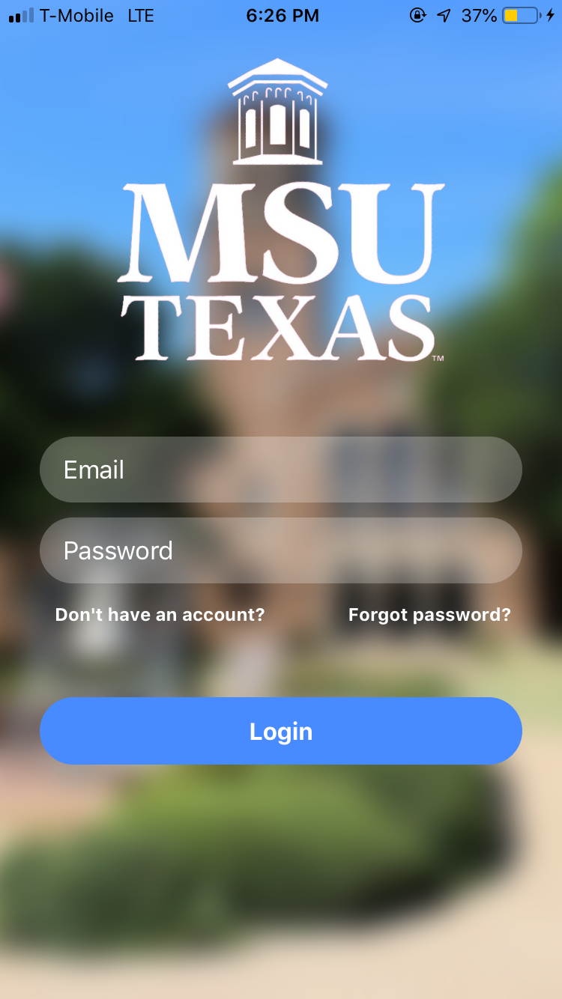
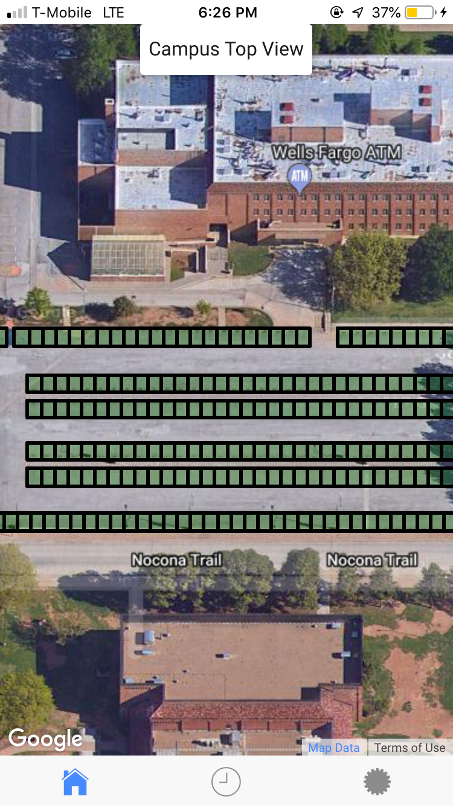
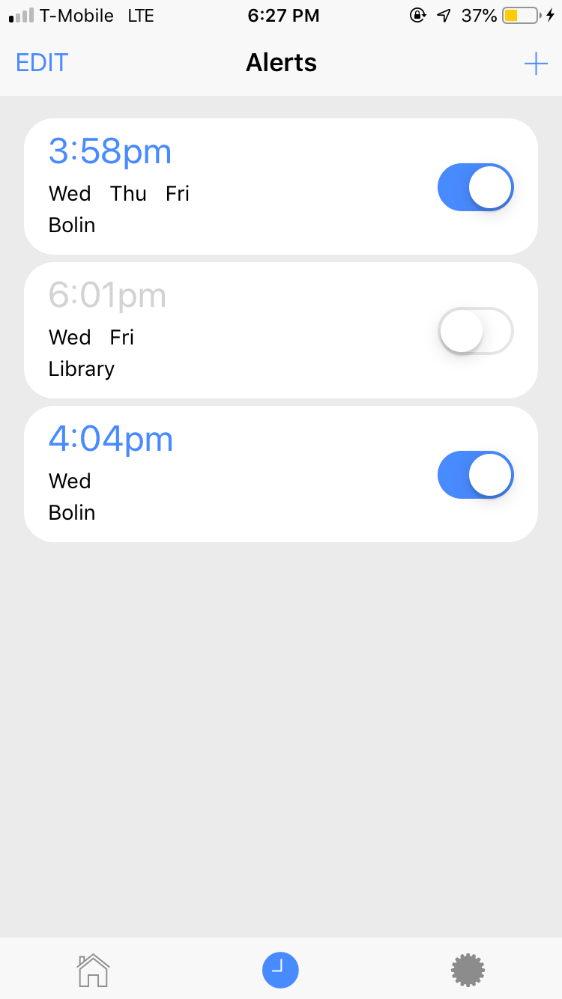
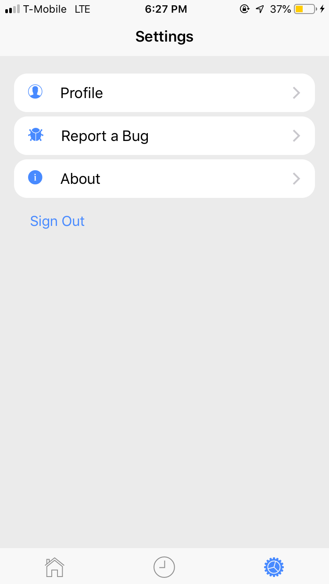

# Midwestern State University Mobile Application for the Parking Lot Occupancy Tracking Project

Mobile application (in development) for Midwestern State University that enables students to locate available parking spaces around campus in real time. The project associated with determining which spaces are available can be found at https://github.com/rugbyprof/Parking-Lot-Occupancy-Tracking.

## Screenshots of the current version of the application

   
  

## Built with

* **Ionic Framework Cli: 3.19.1**
* **Apache Cordova 8.0**
* **Backend: Firebase**
 
## Deployment

* **Not yet available**

## Authors

* **Shady Boukhary** 

## Additional Information

* **Repository associated with defining the parking spaces on google maps: https://github.com/ShadyBoukhary/parking-spaces-overlays-MSU**

## References

* https://ionicframework.com/docs/

